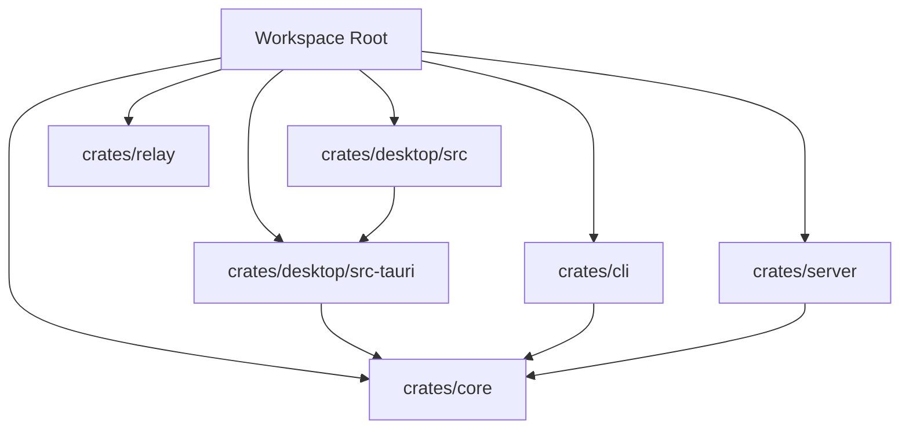
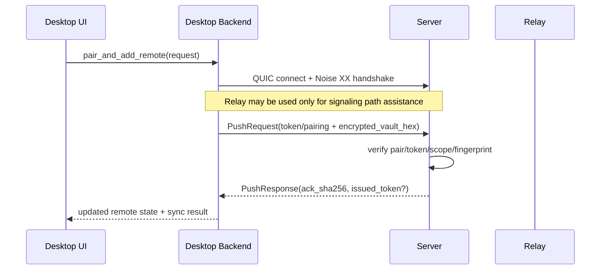

# ClavisVault Architecture

## Workspace Topology

## Core Module Breakdown
`crates/core/src` modules:
- `types`: canonical vault and encryption framing types, migration logic, zeroization hooks.
- `encryption`: KDF/AEAD lock-unlock flows and password attempt limiter.
- `safe_file`: backup+atomic-write abstraction and local filesystem implementation.
- `agents_updater`: guarded-block management for AGENTS files.
- `openclaw`: JSON/JSONC merge pipeline for OpenClaw integration.
- `project_linker`: linked file/watch-folder discovery and synchronization.
- `policy`: secret policy TOML loading and rule validation.
- `rotation`: key rotation status and mutation helpers.
- `audit_log`: tamper-evident chain, integrity checks, retention.
- `export`: signed encrypted export/import trust model.
- `recovery`: recovery drill checks and report generation.
- `platform`: OS-specific data/config directory helpers.
- `shell`: shell hook and export snippet generation.

## Desktop Runtime Design
Frontend (`crates/desktop/src`):
- React app shell (`App.tsx`) orchestrates unlock flow, tabs, and keyboard shortcuts.
- Tab components: `VaultTab`, `AgentsTab`, `RemotesTab`, `SettingsTab`.
- `lib/api.ts` is the typed invoke bridge to backend commands.
- `store/appStore.ts` maintains global app state.

Backend (`crates/desktop/src-tauri/src/lib.rs`):
- `DesktopState` stores runtime settings, remotes, linker state, and `VaultRuntime`.
- `VaultRuntime` manages encrypted/decrypted vault material, master key cache, and limiter/audit state.
- Tauri command handlers gate all mutation and remote operations.

## Remote Sync Path

## Server Trust Model
- Server state file stores pairing/token/password digest, TLS material, binding fingerprints, and revocation list.
- Session tokens are Ed25519-signed and scope-limited.
- Commands accepted from authenticated flows: `push`, `erase`, `revoke`.
- Vault writes use `SafeFileOps` backup+atomic semantics.

## Relay Trust Model
- Validates protocol envelope and rate limits.
- Maintains ephemeral peer map and forwards datagrams to hinted peers or bounded fanout.
- Does not decrypt vault payloads, but can observe metadata (source IP/rates/peer hashes).

## Testing Layout
- Core: deep unit tests + fuzz targets in `crates/core/fuzz/fuzz_targets`.
- Desktop backend: extensive Rust tests in `crates/desktop/src-tauri/src/lib.rs`.
- Desktop GUI: Playwright E2E under `crates/desktop/tests/e2e`.
- Server and relay: unit-heavy tests in single-file binaries.
- CLI: parser, session token, and command behavior tests in `crates/cli/src/main.rs`.
