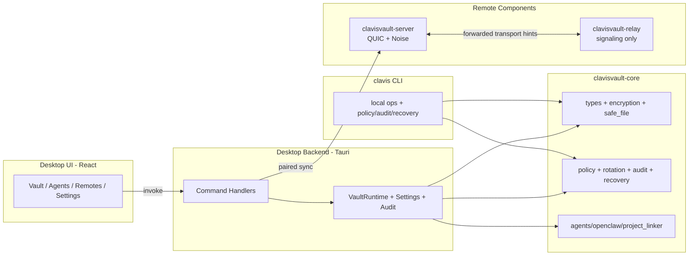

# ClavisVault SPEC (Current Implementation)

Last regenerated: 2026-02-26

## 1. Overview
ClavisVault is a Rust 2024 workspace for secure developer secret management across desktop, CLI, and optional remote sync endpoints.

Workspace members:
- `crates/core`
- `crates/desktop`
- `crates/desktop/src-tauri`
- `crates/server`
- `crates/relay`
- `crates/cli`

Non-negotiable implementation invariants:
- `#![forbid(unsafe_code)]` across security-critical binaries/libraries.
- Vault persistence is encrypted-at-rest (Argon2id + ChaCha20Poly1305).
- Secret-bearing file writes follow backup then atomic replacement semantics.
- Managed file sections (`AGENTS.md`, `openclaw.json` region) are deterministic and bounded.
- Relay is signaling-only and never decrypts end-to-end vault payloads.

## 2. Core Crypto and Vault Model
`crates/core` defines canonical data contracts in `src/types.rs`:
- `VaultData { version, salt, keys }`, with current `version = 2` and migration from legacy data.
- `KeyEntry` includes metadata for lifecycle and rotation (`created_at`, `expires_at`, `rotation_period_days`, `warn_before_days`, `last_rotated_at`, `owner`).
- `EncryptedVault` / `EncryptedHeader` frame MessagePack serialized encrypted payloads.
- `MasterKey` zeroizes internal bytes on drop.

KDF + encryption parameters in `src/encryption.rs`:
- Argon2id (`memory_cost=19456 KiB`, `time_cost=4`, `parallelism=1`, `32-byte output`).
- ChaCha20Poly1305 with random 12-byte nonce per encryption.
- Plaintext serialization buffers are zeroized after encrypt/decrypt.

## 3. File Safety Contract
`src/safe_file.rs` provides `SafeFileOps`:
- `backup(path)`
- `restore(backup)`
- `atomic_write(path, data)`

`LocalSafeFileOps` ensures:
- backup creation before mutation,
- same-directory temp-file write + rename replace,
- rollback/restore on write failure,
- backup retention trimming (default 10 backups).

## 4. Managed File and Linker Flows
- `src/agents_updater.rs`: updates only text between:
  - `<!-- CLAVISVAULT-START -->`
  - `<!-- CLAVISVAULT-END -->`
- `src/openclaw.rs`: parses JSON/JSONC, deep-merges `clavisVault` key, preserves/sets managed env comment marker.
- `src/project_linker.rs`: recursively discovers and syncs managed files under configured folders, with watcher debounce.

## 5. Policy, Rotation, Audit, Recovery
- Policy: `src/policy.rs` loads TOML rules and emits `PolicyViolation` list.
- Rotation: `src/rotation.rs` reports `Healthy | Due | Expired | NoPolicy` and applies secure metadata updates in `rotate_key`.
- Audit: `src/audit_log.rs` maintains tamper-evident chain entries and periodic checkpoints with integrity verification.
- Recovery: `src/recovery.rs` runs structural recovery drills (vault read/decode, backup presence, optional export verification).

## 6. Desktop Application
`crates/desktop` is split into UI + backend:
- React 19 frontend (`src/`) with Zustand and TanStack Query.
- Tauri backend (`src-tauri/src/lib.rs`) hosting runtime state and command handlers.

Key command groups:
- vault lifecycle: bootstrap, unlock, lock, password rotation.
- key operations: list/upsert/delete/copy/export/import/rotate.
- linker/remotes: sync, pair, list, remove, revoke.
- observability: audit list/verify, recovery drill, rotation findings.
- operational: settings, shell hooks, update checks, alert acknowledgement.

## 7. Server and Relay
Server (`crates/server`):
- headless QUIC endpoint (`default 0.0.0.0:51821`) with Noise_XX framing.
- pairing challenge with TTL and checksum.
- scoped signed token issuance (`push`, `erase`, `revoke`) and revocation list.
- supports authenticated full-vault push and explicit remote erase/revoke commands.

Relay (`crates/relay`):
- UDP datagram forwarding (`default 0.0.0.0:51820`).
- protocol gate: `CLAVISRL` magic + version + declared payload length + sender hash.
- source IP, peer, and source-peer rate limiting.
- target-hint routing and bounded fanout.

## 8. CLI Surface
`crates/cli/src/main.rs` provides:
- `env-load`
- `add-key`, `list`, `remove-key|rm-key`, `rotate-key`
- `policy check`
- `audit verify`
- `recovery-drill`
- `shell-hook`

CLI authentication supports password, session token file, and guarded legacy token compatibility paths.

## 9. CI, Quality Gates, and Release
Local recipes are in `Justfile`:
- `just ci-fast`: hygiene + fmt + lint + build + quick tests.
- `just ci-deep`: `ci-fast` + full tests + coverage + security + docs.

CI (`.github/workflows/ci.yml`) enforces:
- matrix check job (Windows 2022, macOS 15, Ubuntu 24.04),
- coverage gate for `clavisvault-core` (>=95%),
- audit + deny checks,
- extreme smoke script,
- desktop GUI E2E on Windows.

Release tooling:
- `scripts/release.ps1`
- `scripts/release.sh`

## 10. Architecture Diagram

## 11. Trust Boundary Notes
- Core handles encryption, policy, and file-safety semantics and is the primary security boundary.
- Desktop runtime keeps decrypted vault material in-memory only during unlocked sessions.
- Server must be treated as trusted infrastructure for state custody.
- Relay is protocol-limited but metadata-observable infrastructure.
